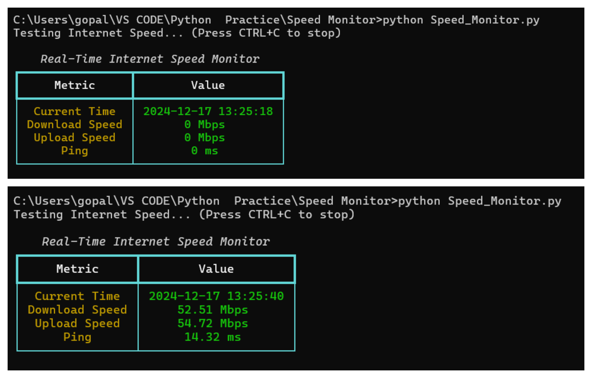
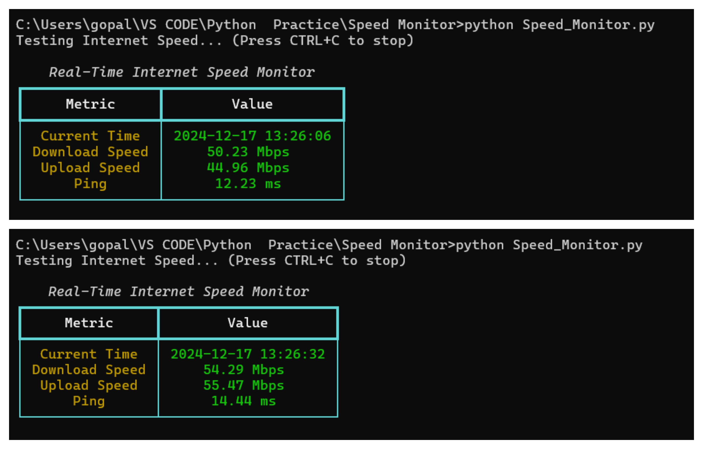
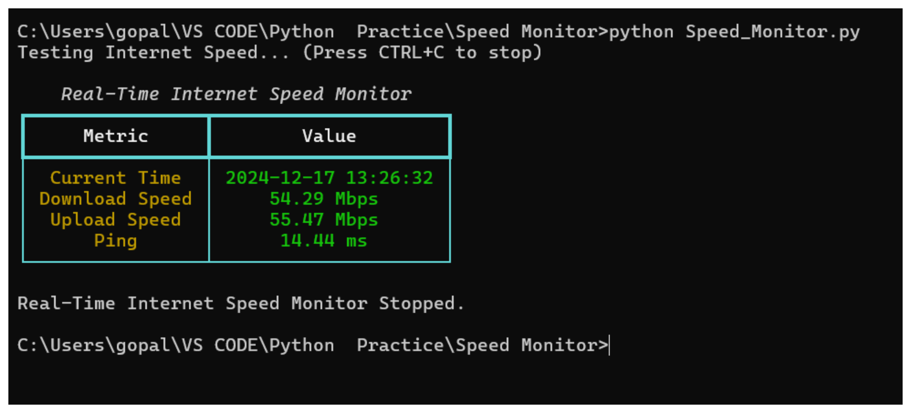

# Real-Time Internet Speed Monitor 📶

This Python project is a real-time **Internet Speed Monitor** that checks your download speed, upload speed, and ping dynamically with periodic updates. It also displays the current time and date for each test iteration.

---

## Key Features 🚀

1. **Real-Time Updates**:
   - Continuously tests and displays download speed, upload speed, and ping in real time.

2. **Dynamic Table**:
   - A well-structured table shows the results with clear metrics like:
     - Current Time
     - Download Speed (Mbps)
     - Upload Speed (Mbps)
     - Ping (ms)

3. **User-Friendly**:
   - Easily view results with live updates in the terminal.

4. **Refresh Rate**:
   - Tests are updated every 5 seconds (configurable).

---

## Requirements 🛠️

Make sure the following libraries are installed:
- speedtest-cli → For measuring internet speed.
- rich → For creating beautiful, dynamic tables in the terminal.

### Install Dependencies:
```bash
pip install speedtest-cli rich
```

## How to Run the Script 💻

1. Clone the repository or download the script file.
2. Open your terminal or command prompt and run the script:

```bash
python Speed_Monitor.py
```

3. The output will look like this:

### Example Output 📊

Initial Start:


Speed Test in Progress:


Stopping the Script:



## Script Overview 📝

The script fetches:
* **Download Speed** → Measured in Mbps.
* **Upload Speed** → Measured in Mbps.
* **Ping** → Measured in milliseconds.

It dynamically updates these values and displays them in a terminal-based table.

## Stop the Script ⏹️

* Use `CTRL+C` to stop the script at any time.

## Author ✍️

* **Harikrishnan Gopal**

## License 📄

This project is licensed under the **MIT License**.
